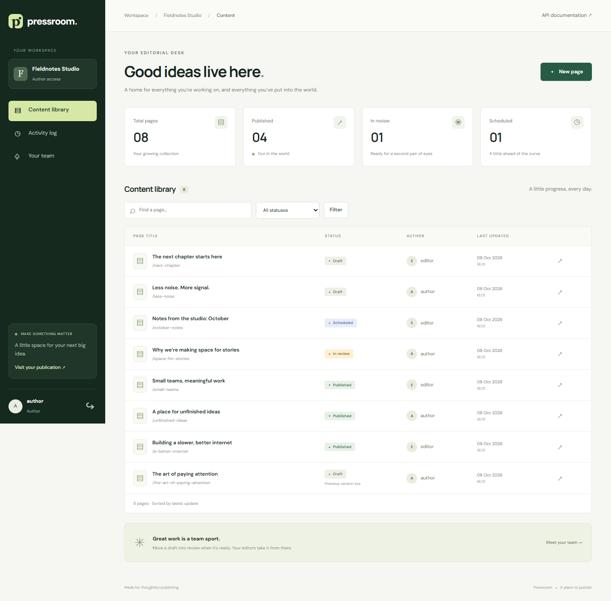
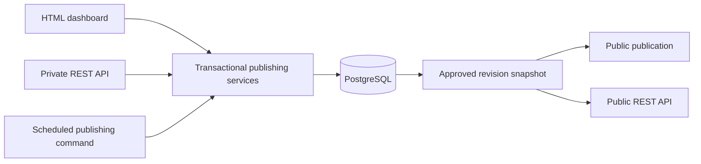
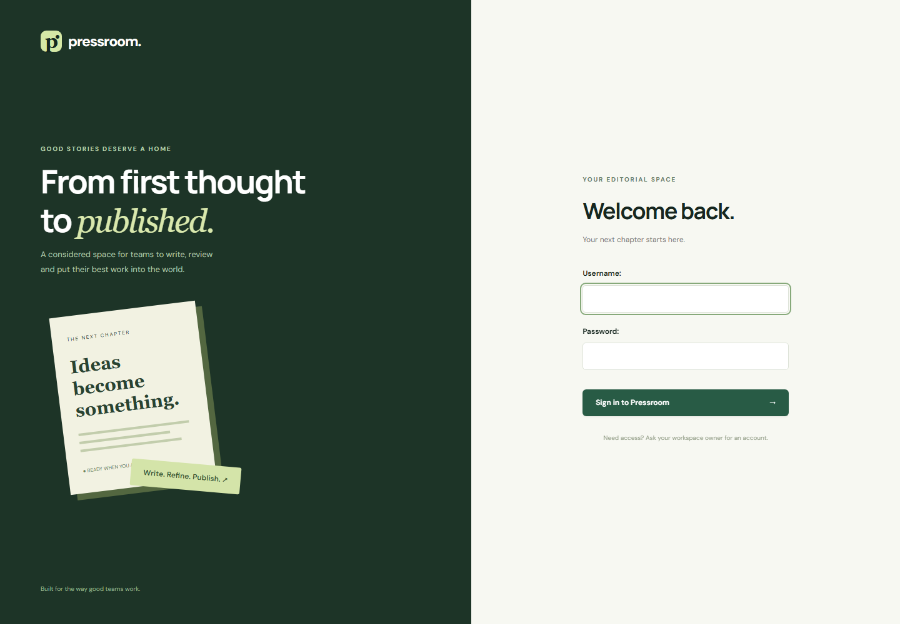
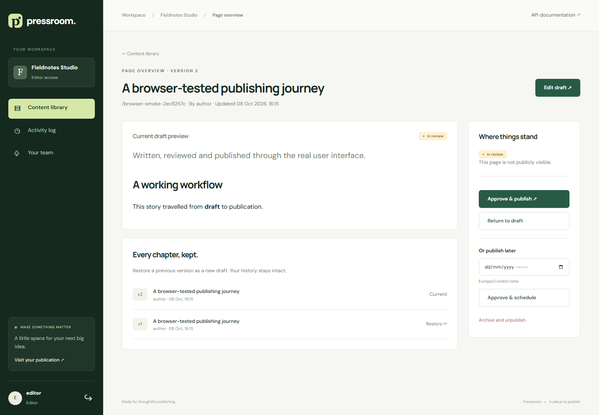
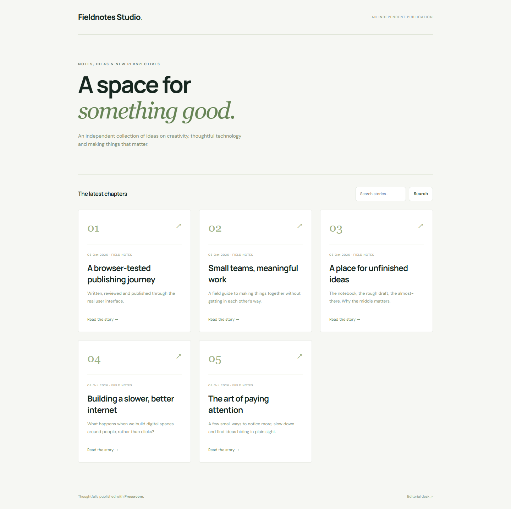

# Pressroom

**A considered space for teams to write, review and publish.**

[](https://github.com/Mohamedajab/pressroom/actions/workflows/ci.yml)


Pressroom is an original team CMS inspired by the editorial problems that systems like Wagtail solve. It combines a responsive editorial dashboard, a public publication and a headless REST API. It does not depend on Wagtail or copy its source code.

**Verified:** 70 tests passing against PostgreSQL on Python 3.12/3.13, 97.63% backend coverage, and a successful Docker build. [Verification record](docs/verification.md).



## What it does

- **Workspace isolation:** private pages, revisions, membership and audit endpoints check workspace access before returning data.
- **Four roles:** owners manage teams; editors review and publish; authors edit their own pages; viewers read the workspace.
- **An actual approval workflow:** draft → review → published or scheduled. Rejection returns a page to draft; archiving removes it from the public site.
- **Safe live editing:** public pages and API responses read an approved revision snapshot. Unapproved edits never replace the live content.
- **Version history:** restore an old revision as a new draft without erasing later revisions.
- **Conflict detection:** browser forms and API mutations require `expected_version`; stale API writes receive HTTP 409.
- **Scheduled publishing:** an idempotent management command publishes approved snapshots. Editing a scheduled page cancels its approval and schedule.
- **Audit trail:** create, edit, restore, workflow and membership changes are recorded transactionally.
- **Readable APIs:** token/session authentication, pagination, search, status filters and an OpenAPI specification with interactive documentation.
- **Safe Markdown:** an allowlist sanitizer strips scripts, event handlers and unsafe URL protocols.
- **Delivery tooling:** pinned dependencies, PostgreSQL Docker Compose, a non-root app image, health checks and CI.

## Stack

| Layer | Technology |
|---|---|
| Application | Python 3.12+, Django 5.2 LTS |
| API | Django REST Framework, drf-spectacular / OpenAPI |
| Data | PostgreSQL 16 in Compose/CI; SQLite for a quick local start |
| UI | Django templates, responsive CSS, progressively usable HTML forms |
| Content | Markdown + Bleach sanitization |
| Deployment | Docker Compose, Gunicorn, WhiteNoise |
| Quality | pytest, pytest-django, coverage, Ruff, GitHub Actions |
| Browser verification | Playwright smoke flow, desktop and mobile screenshots |

The UI uses server-rendered templates deliberately: the focus is the Python backend and editorial correctness. No Node build is required. Fonts load from Google Fonts, with local system font fallbacks.

## Run locally

### Windows PowerShell

```powershell
git clone https://github.com/Mohamedajab/pressroom.git
cd pressroom
py -3.12 -m venv .venv
.\.venv\Scripts\python.exe -m pip install -r requirements-dev.txt
.\.venv\Scripts\python.exe manage.py migrate
.\.venv\Scripts\python.exe manage.py seed_demo --password 'Pressroom-demo-2026!'
.\.venv\Scripts\python.exe manage.py runserver
```

### macOS / Linux

```bash
git clone https://github.com/Mohamedajab/pressroom.git
cd pressroom
python3 -m venv .venv
source .venv/bin/activate
pip install -r requirements-dev.txt
python manage.py migrate
python manage.py seed_demo --password 'Pressroom-demo-2026!'
python manage.py runserver
```

Open [localhost:8000](http://localhost:8000). The local-only demo has `owner`, `editor`, `author` and `viewer` accounts, using the password supplied to `seed_demo`.

| Destination | URL |
|---|---|
| Editorial dashboard | `/workspace/fieldnotes/` |
| Public publication | `/sites/fieldnotes/` |
| Interactive API docs | `/api/docs/` |
| OpenAPI schema | `/api/schema/` |
| Database readiness | `/health/` |

`seed_demo` refuses to run with `DEBUG=false`. It never resets an existing account’s password and leaves an existing demo workspace alone.

To create your own workspace instead:

```bash
python manage.py bootstrap_workspace my-studio --name "My Studio" --username mohamed
```

New owner accounts prompt for a password. Additional accounts can be created through `createsuperuser`/Django user administration, then added to the workspace through the team screen. Public self-signup and invitation emails are outside this release.

## Run with PostgreSQL and Docker

```bash
cp .env.example .env
# Set your local POSTGRES_PASSWORD and SECRET_KEY in .env.
docker compose up --build -d
docker compose exec web python manage.py seed_demo --password 'Pressroom-demo-2026!'
```

On PowerShell, replace `cp` with `Copy-Item .env.example .env`. Use a URL-safe PostgreSQL password (for example a random hex value), because Compose assembles `DATABASE_URL` from it.

Compose runs four services: PostgreSQL, one-shot migrations, the app and a scheduler that checks due pages every 30 seconds. The database is not exposed to the host. The app binds to `127.0.0.1:8000`; this is a local demonstration configuration.

## Test and check

```bash
pytest --cov=publishing --cov-report=term-missing --cov-fail-under=85
ruff check .
ruff format --check .
python manage.py check
python manage.py makemigrations --check --dry-run
python manage.py spectacular --validate --fail-on-warn --file openapi.yaml
```

CI runs the suite on Python 3.12 and 3.13 against PostgreSQL, checks production settings and builds the container image. SQLite runs skip the two PostgreSQL concurrency tests; those tests race two edits and two scheduler workers using separate database connections.

Optional browser verification, against a running **local demo**:

```bash
pip install -e '.[browser]'
python -m playwright install chromium
python scripts/browser_smoke.py --password 'Pressroom-demo-2026!'
```

The smoke flow creates a page as an author, submits it, signs in as an editor, approves it, reads the public article and archives it. It also checks for mobile document overflow and captures screenshots. Its archived test page remains in demo history.

## API example

Create a token locally with `python manage.py drf_create_token author`. Keep it outside the repository and use HTTPS for remote API requests.

```bash
curl http://localhost:8000/api/workspaces/fieldnotes/pages/ \
  -H "Authorization: Token YOUR_TOKEN"

curl -X POST http://localhost:8000/api/workspaces/fieldnotes/pages/ \
  -H "Authorization: Token YOUR_TOKEN" -H "Content-Type: application/json" \
  -d '{"title":"A new chapter","slug":"a-new-chapter","body":"## Hello\nA first draft.","excerpt":"A small beginning."}'
```

All edit, workflow and restore requests include `expected_version`. Use the latest version returned by the API after each successful mutation. See [the API guide](docs/api.md) for the complete route map.

## How it works



The consequential logic sits in `publishing/services.py`. HTML views and API views validate their inputs and call the same service functions. PostgreSQL row locks serialize mutations; a version check detects stale clients. A content revision, page update and audit event commit together or roll back together.

More detail: [architecture and decisions](docs/architecture.md), [deployment](docs/deployment.md), [demo and interview guide](docs/portfolio.md).

## Screens

| Sign in | Editorial review |
|---|---|
|  |  |



## Scope

This is a portfolio application with tested core workflows, not a drop-in replacement for Wagtail. This release does not include media uploads, block editing, SSO, billing, email invitations or a hosted production service. Audit events are append-only through application endpoints, not a tamper-proof compliance ledger. Rate limiting uses Django’s local-memory cache, so limits are per worker; a shared cache is the next step for a scaled deployment.

## Contributing

See [CONTRIBUTING.md](CONTRIBUTING.md). Small, tested improvements are welcome. The project is MIT licensed.
