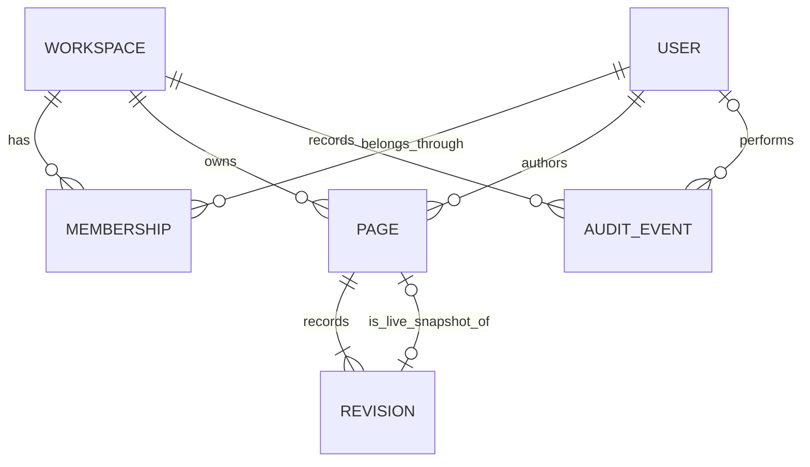
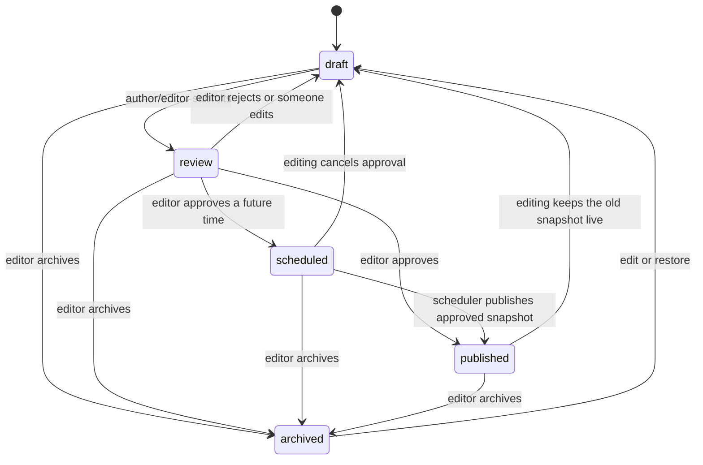

# Architecture and decisions

## The problem

Teams need to edit live content without immediately publishing every keystroke, approve a specific version, recover old work and know who changed it. The key design decision is to keep editable state separate from the approved public snapshot.

## Domain model

- `Workspace` is the access boundary. Page slugs are unique within it, not globally.
- `Membership` assigns a role to a user within one workspace. All team members can read workspace drafts and history; authors can modify only their own pages.
- `Page` holds the working title, excerpt, Markdown body, workflow status and resource version.
- `Revision` stores a snapshot on every content or workflow change. Snapshot contents are never updated by application endpoints.
- `published_revision` points to the content approved for public consumption. `approved_revision` temporarily holds the snapshot approved for future publication.
- `AuditEvent` is written with the mutation in the same database transaction.

## Workflow

An author's own page may be edited in any state. Editing or restoring always returns it to draft and cancels any pending schedule. Archiving clears the live pointer. Restore creates a fresh resource version using historical content; it never reuses an old version number.

## Concurrency and consistency

1. Begin a transaction.
2. Select the page with `select_for_update()`.
3. Check workspace membership and the required role/ownership.
4. Compare `expected_version` with the persisted resource version.
5. Validate the transition, update the page, append a revision and append an audit event.
6. Commit, or roll everything back.

`version` describes the entire editable resource, including its workflow state. It increases even if only status changes. This prevents approving a stale review screen. Public API `revision` identifies the frozen public snapshot, so it can be lower than the current editable version.

Create operations lock the workspace before checking slug uniqueness. Membership changes use the same workspace lock so concurrent owner demotions cannot remove the last owner.

The scheduler first finds due IDs, then locks and re-checks each page inside its own transaction. Two workers may discover the same ID, but the second sees the completed state after acquiring the lock and skips it. It uses the stored approved snapshot, never the working body. Editing invalidates both the schedule and approval pointer.

SQLite is convenient for setup and verifies version-conflict logic, but its `select_for_update()` behaviour does not establish the PostgreSQL concurrency guarantee. Separate-connection race tests run against PostgreSQL in CI.

## Access control

| Action | Owner | Editor | Author | Viewer | Anonymous |
|---|---|---|---|---|---|
| Read workspace drafts/history | Yes | Yes | Yes | Yes | No |
| Create a page | Yes | Yes | Yes | No | No |
| Edit/restore/submit | Any page | Any page | Own page | No | No |
| Approve/reject/archive | Yes | Yes | No | No | No |
| Manage members | Yes | No | No | No | No |
| Read published site/API | Yes | Yes | Yes | Yes | Yes |

API views scope queries to the selected workspace, including lists. Object permissions alone would not secure list responses. Membership is checked before private resource lookup. A page ID from a different workspace receives 404 after the caller passes the selected workspace's membership check.

## Tradeoffs

- **Templates rather than an SPA:** fewer moving parts, CSRF-protected forms and a stronger focus on Python. The public API leaves room for a separate frontend later.
- **Markdown rather than a block editor:** smaller content model and straightforward snapshotting. Sanitization happens at HTML rendering; the API returns Markdown.
- **Polling scheduler rather than Celery:** a management command is easy to operate and test. Database locking and re-checking provide idempotency without a message broker.
- **Immutable slugs through editing endpoints:** prevents breaking public URLs in this release. Changing slugs later would need redirect history.
- **No application delete endpoint:** archived content preserves history. Retention and account deletion would require a separate policy and migration.
- **Application audit trail:** useful provenance, but database administrators can change data. Signed/external logs would be a separate requirement.

## Next useful improvements

Add email invitations with expiring signed tokens; move rate limiting to a shared cache; add PostgreSQL full-text search; support image uploads with validation and object storage; add a public cache keyed by published revision; instrument scheduler failures and publication latency.
